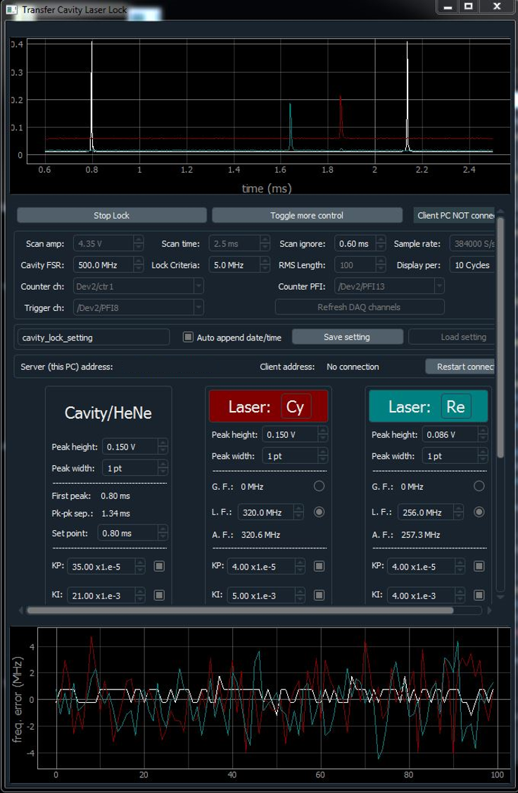
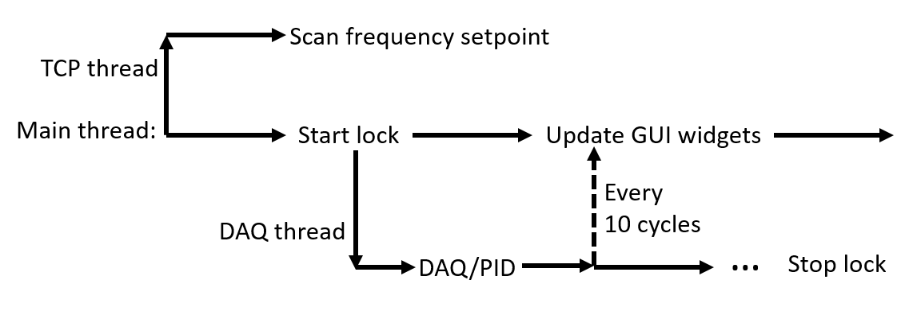

# Digital-transfer-cavity-laser-lock

This graphical user interface (GUI) is designed for the purpose of frequency stabilization of external cavity diode lasers (ECDL) through a transfer cavity. This GUI provides flexible digital feedback loops that can lock laser frequencies for days. With that, ECDL's intrinsic ≲ 1 MHz linewidth makes it suitable for exciting many atomic/molecular transitions, for example, alkali D lines, without the need of further narrowing.

In this frequency stabilization method, the cavity is first locked to a stable frequency source, for example, a helium-neon laser, by scanning the cavity and locking the position of transmission peaks of the frequency reference using a proportional-integral-derivative (PID) feedback loop. Then ECDLs can be frequency stabilized to the cavity by locking the position of their own transmission peaks using PID loops. Transmission peaks are detected by photodetectors and ECDL frequencies is adjusted by piezo actuators. A National Instruments (NI) data acquisition (DAQ) card is required for data acquisition and generation. Details of this frequency stabilization method can be found in Chapter 4.7 of this [thesis](http://demillegroup.yale.edu/sites/default/files/files/John%20Barry%20Thesis%20website%20version.pdf). Software developed in that thesis laid the foundation of this work.

Equipped with an Intel Core i7-5820K CPU and a PCIe-6259 DAQ, the digital feedback loop can run at ~200 Hz. A 24-inch 1080p monitor is recommended for best GUI appearance.

## Workflow

Multiple threads are used in this program to avoid blocking the main thread. At the time the program starts, a TCP thread is initialized and set to run. It uses the classic server-client socket structure to listen to a client PC, which may remotely change or scan laser frequency setpoints. An example of the client program can be found [here](https://github.com/qw372/SrF-lab-control/blob/master/drivers/laser_scan.py). A worker thread dedicated for DAQ tasks and PID calculation will be started when users want to start frequency locking. It transfers data back to the main thread every 10 (adjustable) feedback loop cycles using PyQt's signal-slot method, so that latest locking information can be shown in GUI. This thread keeps running until users stop frequency locking, and then it will close all DAQ tasks and release resources.

## DAQ tasks
DAQ tasks in this program are specially designed to work on PCIe-6259. Due to the lack of retriggerability of analog input/output (AI/AO) channels in this DAQ, synchronization between AI task and cavity AO task (which scans and stabilizes the cavity) is achieved by explicitly configuring a [retriggerable counter channel](https://knowledge.ni.com/KnowledgeArticleDetails?id=kA00Z0000019MXxSAM&l=en-US) and using its finite output pulse train as the clock for both tasks. Both tasks are running continuously but only acquire/generate data at the rising edge of the clock. This method avoids restarting tasks in every cycle, which can reduce feedback loop performance. The counter channel is triggered by a digital output (DO) channel at the end of every cycle. The DO channel and laser AO channels (which control laser piezos) are running in *[on demand](https://zone.ni.com/reference/en-XX/help/370466AC-01/mxcncpts/smpletimingtype/)* mode, in which DAQ processes data as fast as possible. If an X-series DAQ with retriggerable AI/AO channels is used, it may not be necessary to use a counter as the clock.
